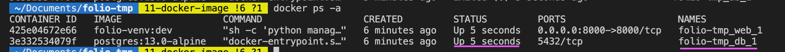

# folio-backend

### 利用 Docker virtual environment 啟動後端應用程式

啟動 docker desktop，並執行下列指令以在 docker 環境中啟動後端

```
docker-compose build # 建立 Django Image
docker-compose up # run server
```

### 建立開發環境

先進到虛擬環境 (if any)，安裝 poetry 並用 poetry 安裝開發所需套件

```
pip install
poetry install
```

接著安裝 pre-commit hooks

```
pre-commit install
pre-commit install -t pre-push
pre-commit install -t commit-msg
```

### 如何進到 psql ?

1. 輸入 `docker ps -a` 確認 db 的 container 有在 run。
   

2. 進到 db container 的 shell
   ```shell
   $ docker exec -it folio-tmp_db_1 /bin/sh # db image name may be different
   ```
3. 進到 psql，會要你輸入密碼：範例是 secret1234
   ```
   / # psql -d folio -U root -W
   ```
4. 再看看 public 底下的 Django tables 應該都匯入了。
   ```
   folio=# \dt public.*
   ```
5. 輸入 `quit` 離開 psql 並按 `ctrl+D` 離開 db container 的 shell
   

### 如何在 docker 環境下安裝 package

照這篇[解答](https://stackoverflow.com/questions/63027514/install-package-in-running-docker-container)做，或是 poetry add 後重新 docker-compose build

## 如何 deploy to Heroku

```shell=
# Add the heroku remote repo(do it once)
heroku git:remote -a folio-backend-staging
heroku container:push web
heroku container:release web
```
